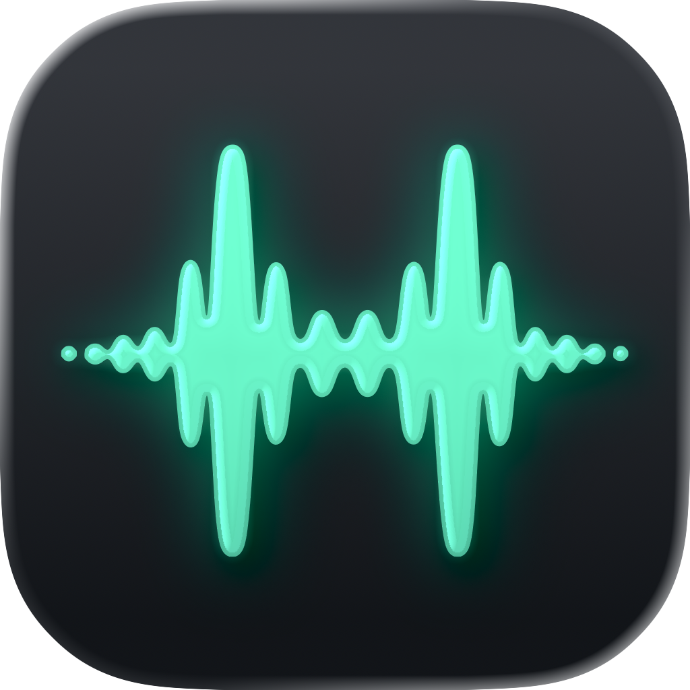

<p align="center">
  
</p>

<h1 align="center">Hark</h1>

Hark records your microphone and the audio you hear, then turns the conversation into a clean, speaker-labeled transcript. Everything runs on-device: nothing is uploaded, and no account or setup is required.

The goal is a simple utility that just works and feels delightful. Open it, press record, and get a transcript you can actually read. You are labeled You, and each other participant becomes Speaker 1, Speaker 2, and so on.

- Captures your microphone and the system audio you hear as two synchronized tracks.
- Transcribes and separates speakers on-device into one merged timeline.
- Stays fully local and private, with no cloud services in the loop.

## Requirements

Hark runs on macOS 26 or later.

## Contributing

Hark is a SwiftUI app. The Xcode project is generated from `project.yml` with XcodeGen, and common tasks run through the Makefile. Install the toolchain with `brew install xcodegen swiftformat swiftlint` and build with Xcode 26.

```sh
make build   # generate the project and build
make run     # build and launch
make test    # run the unit tests
make lint    # check formatting and SwiftLint
```

Application code lives in `Sources/` and tests in `Tests/`. Transcription and speaker diarization run on-device through [FluidAudio](https://github.com/FluidInference/FluidAudio), and its models download on first transcribe. See [CONTRIBUTING.md](CONTRIBUTING.md) for the recording, transcription, and diarization internals.
